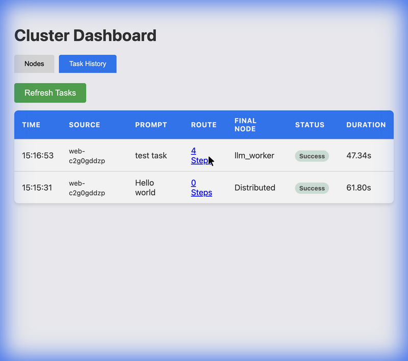

# Local Distributed LLM Lab

**A distributed cognition framework for local AI experiments.**


## 🚀 Overview
**Local Distributed LLM Lab** orchestrates multiple local devices—laptops, desktops, and mobile phones—into a single collaborative AI cluster. Instead of simply sharding model weights (like tensor parallelism), it focuses on **task-level parallelism** and **heterogeneous agents**.

A powerful Planner LLM decomposes complex queries into subtasks, which are then routed to the most appropriate worker node (e.g., a high-RAM laptop for inference, a phone for simple tool execution).

## ✨ Features
- **Distributed Coordination**: Powered by **Ray** and **FastAPI**.
- **Agentic Workflow**: Task decomposition using **LangGraph** & **Ollama**.
- **Mobile Integration**: Turn your Android/iOS device into a worker node via a simple PWA.
- **Auto-Discovery**: Nodes automatically register capabilities via a decentralized heartbeating mechanism.
- **Resilient**: "Best-effort" execution design tolerates node failures.

## 🏗 Architecture
1.  **Coordinator Node**: The brain. Runs the API, Planner, and Task Graph.
2.  **Worker Nodes**:
    *   **Ray Workers**: Python-based, capable of heavy inference (Llama 3, Mistral).
    *   **Mobile Workers**: WebSocket-based, capable of light tasks (SLMs like Gemma-2b, or simple tools).
3.  **Communication**: Event bus for heartbeats and task routing.

## 🛠 Installation

### Prerequisites
- Python 3.11+
- [Ollama](https://ollama.com/) (running locally)
- [Redis](https://redis.io/) (Optional, for production persistence)

### Quick Start
1.  **Clone the repository**:
    ```bash
    git clone https://github.com/xdutsuay/local-distributed-llm-lab.git
    cd local-distributed-llm-lab
    ```

2.  **Install dependencies**:
    ```bash
    python3 -m venv venv
    source venv/bin/activate
    pip install -r requirements.txt
    ```

3.  **Start the Coordinator**:
    ```bash
    # Listen on all interfaces to allow mobile connections
    uvicorn coordinator.main:app --host 0.0.0.0 --port 8000
    ```

4.  **Connect a Mobile Node**:
    *   Find your LAN IP (e.g., `192.168.1.5`).
    *   Open `http://192.168.1.5:8000` on your phone's browser.
    *   Watch it appear in the dashboard!

## 🧪 Dashboard
Visit `http://localhost:8000/llmlab` to visualize the cluster, track task history, and inspect execution routes.



## 🔌 Connect Remote Node (LM Studio)
You can connect a second laptop running **LM Studio** as a worker node:
1. Start LM Studio Server on Laptop 2 (Port 1234).
2. Update `coordinator/main.py` to spawn a worker pointing to Laptop 2's IP.
   ```python
   LLMWorker.remote(model_name="local-model", api_base="http://192.168.1.X:1234/v1")
   ```
3. The new worker will appear in the dashboard! (See [docs/CONNECT_REMOTE.md](docs/CONNECT_REMOTE.md) for details).

## 🗺 Roadmap
- [x] **Phase 0-1**: Basic distributed execution (Ray).
- [x] **Phase 2**: Planner & DAG orchestration (LangGraph).
- [x] **Phase 3**: Node Registry & Health monitoring.
- [x] **Phase 4**: Android PWA Integration.
- [ ] **Phase 5**: MCP Server Integration (Use with Cursor/VSCode).
- [ ] **Phase 6**: Observability & Metrics.

## 🤝 Contributing
Contributions are welcome! Please open an issue or submit a PR.

## 📜 License
MIT License.
