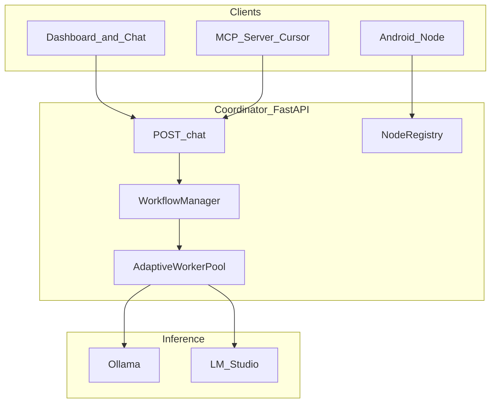

# LLMLAB — Local Distributed LLM Lab

**Turn your Mac, PC, Linux box, and Android phone into one local AI cluster** — no cloud API keys, no vendor lock-in. LLMLAB coordinates inference with [Ray](https://www.ray.io/), plans work with [LangGraph](https://www.langchain.com/langgraph), and routes tasks across [Ollama](https://ollama.com), [LM Studio](https://lmstudio.ai), and optional mobile compute nodes.

[](LICENSE)
[](https://www.python.org)
[](tests/)
[](https://www.ray.io/)
[](https://ollama.com)
[](https://lmstudio.ai)

> **Stable v1 (2026-05-21):** Regression gate, LM Studio/Gemma path, Android compute node, dashboard observability. See [STATUS.md](STATUS.md) and [docs/plans/](docs/plans/).

---

## Why LLMLAB?

| Problem | LLMLAB approach |
|---------|-----------------|
| One machine is slow | **Task-level parallelism** across LAN nodes via Ray |
| Ollama cold-start / swap pain | Dashboard + **SQLite event log** + health scripts |
| No visibility into routing | **Live dashboard** (`/llmlab`) — nodes, tasks, composition |
| IDE agents can't operate the cluster | **MCP server** (planned) — Cursor tools over REST APIs |
| Mobile idle compute | **Android compute node** — WebSocket worker on your phone |

**Keywords:** local LLM cluster, self-hosted AI, distributed inference, Ollama cluster, LangGraph orchestration, Ray Python cluster, multi-agent routing, LM Studio Gemma, open-source LLM orchestration, homelab AI.

---

## Features

- **Multi-node LangGraph workflows** — planner decomposes prompts; workers execute in parallel where possible  
- **Adaptive worker pool** — local inference on one GPU; Ray dispatch when multiple nodes are alive  
- **MicroGPT-style context** — bounded metadata injected before worker calls  
- **Provider switch** — Ollama or LM Studio from the dashboard (`INFERENCE_BACKEND`)  
- **SQLite persistence** — tasks, nodes, and operational events survive restarts  
- **Android compute node** — Kotlin + Compose app; heartbeats and `execute_task` over WebSocket  
- **Regression gate** — 10-step release checklist ([`tests/test_regression_gate.py`](tests/test_regression_gate.py))  

---

## Quick start (5 minutes)

### Prerequisites

- Python **3.12+**
- [Ollama](https://ollama.com) *or* [LM Studio](https://lmstudio.ai) with a loaded model  
- Optional: Ray (`pip install -r requirements.txt` includes `ray[default]`)

### Install

```bash
git clone https://github.com/xdutsuay/local-distributed-llm-lab.git
cd local-distributed-llm-lab
python3 -m venv venv
source venv/bin/activate   # Windows: venv\Scripts\activate
pip install -r requirements.txt
```

### Verify tests (no GPU required)

```bash
PYTHONPATH=. pytest tests/test_regression_gate.py -m "not live" -q
```

### Run coordinator

```bash
./scripts/start_coordinator.sh
```

| URL | Purpose |
|-----|---------|
| http://localhost:8000/llmlab | Cluster dashboard |
| http://localhost:8000/chat_ui | Chat UI |
| http://localhost:8000/health | Health check |

### LM Studio + Gemma (recommended for speed tests)

```bash
# In LM Studio: load a model (e.g. Gemma), start server on http://127.0.0.1:1234
export INFERENCE_BACKEND=lmstudio
export LMSTUDIO_API_BASE=http://127.0.0.1:1234/v1
./scripts/start_coordinator.sh
```

### Connect a worker (second machine)

```bash
./scripts/start_worker.sh <COORDINATOR_IP>
```

### Android compute node

```bash
cd android-compute-node && ./gradlew assembleDebug
# APK: app/build/outputs/apk/debug/app-debug.apk
# Settings → coordinator IP → ws://<ip>:8000/ws/join
```

---

## Architecture


```mermaid
flowchart TB
  subgraph clients [Clients]
    UI[Dashboard_and_Chat]
    Android[Android_Node]
    MCP[MCP_Server_Cursor]
  end
  subgraph coord [Coordinator_FastAPI]
    Chat[POST_chat]
    Registry[NodeRegistry]
    Graph[WorkflowManager]
    Pool[AdaptiveWorkerPool]
  end
  subgraph inference [Inference]
    Ollama[Ollama]
    LMStudio[LM_Studio]
  end
  UI --> Chat
  Android --> Registry
  MCP --> Chat
  Chat --> Graph --> Pool
  Pool --> Ollama
  Pool --> LMStudio
```

Deep dive: [docs/ARCHITECTURE.md](docs/ARCHITECTURE.md) · [docs/COMPONENTS.md](docs/COMPONENTS.md)

---

## Contributing

We welcome PRs for tests, inference paths, Android protocol alignment, and MCP tooling.

1. Read [CONTRIBUTING.md](CONTRIBUTING.md)  
2. Pick a plan in [docs/plans/](docs/plans/)  
3. Run `pytest tests/test_regression_gate.py -m "not live" -q` before opening a PR  

**Help wanted:** streaming chat UI · Phase 13 RAG · vLLM backend · autoresearch experiment results · docs and reproduction scripts.

**Optional research (Mac):** [autoresearch-macos](https://github.com/miolini/autoresearch-macos) sidecar — see [experiments/autoresearch/README.md](experiments/autoresearch/README.md) and `./scripts/run_autoresearch.sh`.

---

## Documentation

| Doc | Description |
|-----|-------------|
| [STATUS.md](STATUS.md) | Current release status |
| [NEXT_STEPS.md](NEXT_STEPS.md) | Maintainer handoff and inference milestones |
| [REGRESSION_LOG.md](REGRESSION_LOG.md) | Gate and live smoke results |
| [docs/plans/](docs/plans/) | Stable v1 + MCP extension plans |
| [docs/ROADMAP.md](docs/ROADMAP.md) | Phases 12–16+ |
| [docs/TESTING.md](docs/TESTING.md) | Test layout and commands |
| [docs/INFERENCE_PATH.md](docs/INFERENCE_PATH.md) | Ray vs local worker, backends, benchmarks |
| [docs/MCP.md](docs/MCP.md) | Cursor MCP cluster tools |
| [experiments/autoresearch/README.md](experiments/autoresearch/README.md) | Optional autoresearch-macos training sidecar |

---

## MCP server (Cursor / Claude Desktop)

Thin bridge for IDE agents ([`mcp_server.py`](mcp_server.py)). Planned tools: `cluster_health`, `list_nodes`, `submit_chat`, model swap, cache stats. See [docs/plans/EXTEND_MCP_SERVER.md](docs/plans/EXTEND_MCP_SERVER.md).

Example config: [config/claude_config_example.json](config/claude_config_example.json)

---

## Releases

Pre-built binaries (beta): [GitHub Releases](https://github.com/xdutsuay/local-distributed-llm-lab/releases)

---

## License

[MIT License](LICENSE) — use, fork, and ship commercially with attribution.

---

## Star history

If LLMLAB saves you cloud API costs or speeds up local experiments, **star the repo** and open an issue with your setup (OS, GPU, backend). That helps others find a working path faster.
