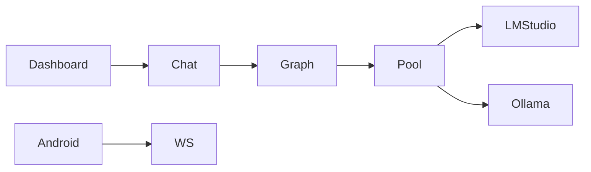

# Stable v1: 10-step regression gate + 48-step day plan

**Status:** Shipped on `main` (2026-05-21, commit `ffc8c0d` and follow-ups).  
**Source session:** Antigravity/Cursor architecture overhaul (Android compute node, test mocks, LM Studio).

## Goal

One **full-stack stable release**: mocked CI green, coordinator + dashboard + LM Studio/Gemma live smoke, Android APK connects and runs tasks.

## Definition of done

1. `PYTHONPATH=. pytest tests/ --ignore=tests/e2e/ -q` — green  
2. Coordinator starts; `/chat` returns 200 with LM Studio (Gemma)  
3. Dashboard provider swap → next chat uses LM Studio  
4. Android: build APK, WebSocket connect, heartbeat in `/api/nodes`, one task round-trip  

## Architecture (high level)



## Part A — 10-step regression gate

Implemented in [`tests/test_regression_gate.py`](../../tests/test_regression_gate.py).

| Step | Name | Scope |
|------|------|--------|
| R1 | Repo hygiene | No staged `build/`, `dist/`, DB binaries |
| R2 | DB + cache unit | `test_db`, `test_caching`, `test_logic` |
| R3 | Worker pool | `test_adaptive_pool`, load balancing, model detection |
| R4 | Coordinator API (mocked) | `test_coordinator`, routes, cluster |
| R5 | Full unit suite | All tests except e2e + regression gate |
| R6 | Distributed cache | Actor + local fallback |
| R7 | Live health | Coordinator + LM Studio reachable |
| R8 | Live chat | POST `/chat`, task in `/api/tasks` |
| R9 | Cache repeat | Second identical prompt |
| R10 | Android E2E | Manual; set `ANDROID_E2E_OK=1` |

**Mocked gate (CI):**

```bash
PYTHONPATH=. pytest tests/test_regression_gate.py -m "not live" -q
```

**Live gate:**

```bash
INFERENCE_BACKEND=lmstudio LMSTUDIO_API_BASE=http://127.0.0.1:1234/v1 ./scripts/start_coordinator.sh
PYTHONPATH=. pytest tests/test_regression_gate.py -m live -q
```

## Part B — 48-step day plan (summary)

**Inference path (Ray vs local, benchmarks):** [INFERENCE_PATH.md](../INFERENCE_PATH.md)

| Phase | IDs | Focus |
|-------|-----|--------|
| 0 | T01–T08 | Baseline pytest, `.gitignore`, commit slices, graphify |
| 1 | T09–T16 | Cache tests, chat 200, LM Studio mock, pool regressions |
| 2 | T17–T24 | Async graph, cache wire-up, `/chat` 503 JSON errors |
| 3 | T25–T32 | Gemma live smoke, Ray on/off notes |
| 4 | T33–T40 | Android Gradle, WS protocol, E2E task |
| 5 | T41–T48 | Full R1–R10, STATUS/NEXT_STEPS, health_check |

**Stop rule:** If R5 fails at midday, do not start R7–R10 until fixed.

## What shipped

- `tests/conftest.py`: Ollama, Chroma, Ray, LM Studio HTTP mocks  
- `coordinator/cache_manager.py`: `RAY_MOCK_MODE` skips Ray actors in tests  
- `coordinator/main.py`: distributed cache init, structured `/chat` errors  
- `coordinator/db.py`: `final_node`, `composition`, `route_details` columns  
- `android-compute-node/`: WebSocket, ComputeEngine, Compose dashboard  
- `pytest.ini`: default `-m "not live"`  

## Live validation notes

See [REGRESSION_LOG.md](../../REGRESSION_LOG.md). Chat UI waits for full LangGraph completion (~23s observed); no streaming yet.

## Checkpoint commits (if regressing)

| Commit | Notes |
|--------|--------|
| `e0aac21` | MicroGPT + UI on Ollama |
| `91a3161` | Mobile mesh + vector memory |
| `113bdfb` | SQLite persistence + AirLLM optional |
| `ffc8c0d` | Stable v1 tag baseline |

## Next milestone

Phase 13 RAG (deferred). See [NEXT_STEPS.md](../../NEXT_STEPS.md) Phase B–C for inference path diagnosis before RAG.
